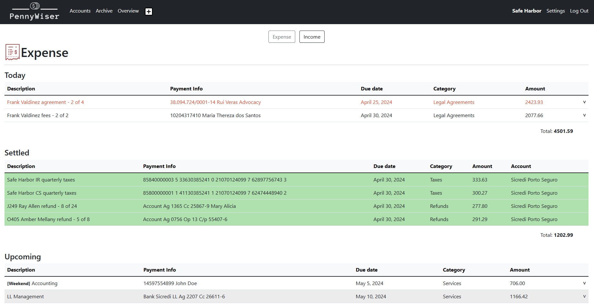

Can you improve a readme.md file that I did for my CS50's Web Programming with Python? Here it goes:

# PennyWiser

## Table of Contents
- [Introduction](#introduction)
- [Technologies](#technologies)
- [Installation](#installation)
- [How PennyWiser Works](#how-pennywiser-works)
    - [Setup](#setup)
    - [Usage](#usage)
- [File Structure](#file-structure)
- [Distinctiveness and Complexity](#distinctiveness-and-complexity)

## Introduction
PennyWiser is a web-based financial management tool designed to facilitate the daily financial control of small businesses. It simplifies financial tasks, including managing accounts payable and receivable, budget projection, and cash flow analysis. Users can track expenses and incomes, including recurring installments. The app categorizes transactions, providing an overview of spending and income by category, and generates summaries resembling bank statements for all accounts, allowing users to quickly check their balances.

This is the capstone project for the HarvardX CS50's Web Programming with Python and JavaScript course.

## Technologies
- Python
- Django
- JavaScript
- Bootstrap

## Installation
To run PennyWiser locally, follow these steps:
1. Clone this repository.
2. Install Python from [python.org](https://www.python.org/).
3. Install dependencies using `pip install -r requirements.txt`.
4. Build the database by running `python manage.py makemigrations` and `python manage.py migrate`.
5. Start the server with `python manage.py runserver`.

## How PennyWiser Works
### Setup:
1. Register a new user.
2. Create Accounts and Categories in the Settings menu:
    - Create all accounts your company has.
    - Create all relevant expense and income categories.

### Usage:
1. **Add Transactions:** Click the "+" sign in the horizontal menu to register a new transaction. Select appropriate options and replicate settings.
2. **Manage Transactions:** The index page displays all expiring and upcoming transactions. Click on a transaction's description to edit it. Settle accounts by clicking the "arrow down" symbol and providing appropriate information.
3. **View Account Summary:** Use the "Accounts" menu option to see a summary of all accounts' balances. Select an account and date to view a bank statement-like report.
4. **Search Transactions:** Use the "Archive" menu to search for all transactions by date, search query, expense or income and/or settled or unsettled status.
5. **View Financial Overview:** The "Overview" page displays an overview of expenses and income by category for the selected date (month/year).
6. **Manage Settings:** Use the "Settings" menu to create new companies, categories, or accounts. Use "Swap company" to switch between multiple company accounts.

## File structure

In addition to the default Django structure, here are all the files created for this project:

### Backend Logic (`/views.py`)

- **Index view**:
Renders the index page and handles account settlement and recurring transactions logic. The algorithm checks if time has passed, if it did, it will check if any unreplicated transaction needs to be replicated.

- **New transaction view**:
Renders the page for creating new transactions.

- **Archive view**:
Renders the archive page for searching and viewing all registered transactions.

- **Edit view**:
Renders the edit page for modifying transaction information.

- **Accounts view**:
Renders the account page that shows a summary of company accounts, offering an account statement with all transactions.

- **Overview view**:
Renders the overview page, displaying a logistics overview of settled and projected expenses and income by category.

- **Settings view**:
Renders the settings page for creating new companies, categories and accounts.

- **Swap company view**:
Allows users to switch between multiple company accounts.

### Javascript functions

- Index page (`/static/core/index.js`)

    Contains the javascript functions used exclusively on the index page. The first one is the **swapTab** function, which controls the income / expense tab: when a button is clicked, it shows the corresponding tab and hides the other. The second is a windows.onload function that sets all dates in the settle form to the current date, since most accounts are settled in the current date, this was made to speed up the settle process.

- Global functions (`/static/core/utils.js`)

    Holds all javascript functions used throughout the application:

    - **showInstallments**, **checkInstallments**, **disableInstallment** and **enableInstallment**: Controls the Installment logic in the New Transaction page. It blocks the installment checkbox if the replicate monthly, bimonthy or quarterly is selected, and it blocks the yearly replicate option and sets it to "once" if the number of installments is set to more than 12. That way installments replicate option can only be set to "once" by any amount of installments, or "yearly" by a maximum of 12 installments. Transactions that repeat monthly, bimonthly or quarterly can't have installments.

    - **showMore**: Handles the slide down and up animations when clicking the "show more" icon (˅).

    - **submitForm**: This function was created to submit a form when the user clicks the description of a transaction, submitting the form in the parent node. This form, specifically, just contains the id of the transaction and redirects to another form filled with that transaction's informations.

    - **showDeleteConfirmation**: Serves as a safety measure, instead of deleting a transaction right away when the delete button is clicked, this function shows a second button confirming if the user really wants to delete it.

    - **swapOverviewTab**: Similar to the **swapTab** function, this allows the user to swap between the "overview" and "projection" pages.

### Styles (`/static/core/styles.css`)

Contains the css file the styles all pages.

### Icons (``/static/core/icons`)

Stores all image files used for logos and icons in the project.

### HTML Templates (`/templates/core`)

All HTML templates created for this project are stored in this folder.

- **account_statement.html**: Shows a bank statement like information for a selected account.

- **accounts.html**: Shows a summary of all accounts balances and redirects to account_statement.html when a month and an account is selected.

- **archive.html**: Used to search through all transactions by income or expense, settled or unsettled, by query word and/or date.

- **edit.html**: Allows users to edit transaction information.

- **index.html**: The main page displaying expired, today's, and upcoming transactions, and where users can settle transactions.

- **layout.html**: The default layout used in all pages.

- **login.html**: Page for user login.

- **new_transaction.html**: Page for adding new transactions to the database.

- **overview.html**: Displays a logistics overview of settled and projected expenses and income by category.

- **register.html**: Page for user registration.

- **settings.html**: Page for creating new companies, categories, or accounts.

## Distinctiveness and Complexity
PennyWiser distinguishes itself by providing tailored financial solutions for tracking expenses, incomes, and accounts, specifically for small businesses. Its focus on financial control, categorization, and reporting sets it apart as a specialized tool for business owners. The project exhibits complexity beyond typical course projects in areas such as transaction handling, recurring transactions, and comprehensive reporting, requiring intricate backend logic, database management, and data aggregation processes.